# SimLens 研究架構圖

```mermaid
flowchart TB
    subgraph DataCollection["數據收集階段"]
        A1[MicroLens-100K<br/>100K觀眾, 19K視頻<br/>719K交互記錄]
        A2[QVHighlights<br/>10K YouTube視頻<br/>精彩片段標註]
        A3[TVSum<br/>50個視頻<br/>重要性分數]
        A4[PersonaChat<br/>8K+ persona描述]
        A5[Big5-Chat<br/>100K對話<br/>Big Five標註]
    end

    subgraph FeatureExtraction["第一層：客觀影片特徵提取"]
        B1[PySceneDetect<br/>場景檢測]
        B2[OpenCV<br/>光流計算]
        B3[Whisper<br/>語音檢測]
        B4[CLIP<br/>視覺特徵]
        
        B1 --> C1[ASD<br/>平均鏡頭時長<br/>1-10分]
        B1 --> C2[SCR<br/>鏡頭切換率<br/>1-10分]
        B2 --> C3[OFM<br/>光流強度<br/>1-10分]
        B3 --> C4[SD<br/>語音密度<br/>1-10分]
        B4 --> C5[CC<br/>內容複雜度<br/>1-10分]
    end

    subgraph PersonaQuantification["Persona 量化框架"]
        D1[LLM提取<br/>Big Five特質]
        D2[提取社交特質<br/>Activity/Conformity/Diversity]
        D3[人口統計特徵<br/>年齡/職業/興趣]
        
        D1 --> E1[Openness: 0-100]
        D1 --> E2[Conscientiousness: 0-100]
        D1 --> E3[Extraversion: 0-100]
        D1 --> E4[Agreeableness: 0-100]
        D1 --> E5[Neuroticism: 0-100]
        
        D2 --> E6[Activity分層]
        D2 --> E7[Conformity分層]
        D2 --> E8[Diversity分層]
    end

    subgraph WeightLearning["第二層：觀眾權重學習"]
        F1[線性回歸<br/>從觀看歷史學習]
        F2[神經網絡映射<br/>Persona特質→權重]
        F3[聚類映射<br/>K-Means聚類]
        
        F1 --> G1[w_ASD]
        F1 --> G2[w_SCR]
        F1 --> G3[w_OFM]
        F1 --> G4[w_SD]
        F1 --> G5[w_CC]
        
        F2 --> G1
        F2 --> G2
        F2 --> G3
        F2 --> G4
        F2 --> G5
    end

    subgraph RetentionPrediction["第三層：留存率計算"]
        H1[Retention_Score = Σ Feature_i × Weight_i]
        H2[Sigmoid歸一化<br/>映射到 0-1]
        H3[時序分析<br/>留存率曲線]
    end

    subgraph Experiments["實驗驗證階段"]
        I1[實驗1: 特徵有效性<br/>QVHighlights t-test<br/>MicroLens相關性]
        I2[實驗2: 權重學習<br/>MAE < 0.2<br/>Pearson r > 0.4]
        I3[實驗3: 消融研究<br/>移除特徵影響]
        I4[實驗4: 基線比較<br/>vs CF/VRAgent-R1]
        I5[實驗5: Persona提取<br/>MAE < 10<br/>Pearson r > 0.6]
        I6[實驗6: 特質映射<br/>Weight MAE < 0.15]
        I7[實驗7: 代理人一致性<br/>Taste Accuracy > 65%]
        I8[實驗8: 真實世界差距<br/>A/B Test Agreement > 80%]
    end

    subgraph Results["研究成果"]
        J1[100%可追溯性<br/>特徵貢獻分解]
        J2[個性化觀眾預測<br/>基於觀眾權重]
        J3[冷啟動支持<br/>Persona虛擬觀眾]
        J4[創作者優化建議<br/>特徵改進指導]
    end

    %% 數據流向
    A1 --> B1
    A1 --> B2
    A1 --> B3
    A1 --> B4
    A2 --> I1
    A3 --> I1
    A4 --> D1
    A5 --> D1
    
    C1 --> F1
    C2 --> F1
    C3 --> F1
    C4 --> F1
    C5 --> F1
    
    E1 --> F2
    E2 --> F2
    E3 --> F2
    E4 --> F2
    E5 --> F2
    E6 --> F2
    E7 --> F2
    E8 --> F2
    
    G1 --> H1
    G2 --> H1
    G3 --> H1
    G4 --> H1
    G5 --> H1
    
    H1 --> H2
    H2 --> H3
    
    C1 --> I1
    C2 --> I1
    C3 --> I1
    C4 --> I1
    C5 --> I1
    
    F1 --> I2
    G1 --> I3
    H2 --> I4
    
    D1 --> I5
    F2 --> I6
    F2 --> I7
    F2 --> I8
    
    H3 --> J1
    G1 --> J2
    F2 --> J3
    H3 --> J4

    style DataCollection fill:#e1f5ff
    style FeatureExtraction fill:#fff4e1
    style PersonaQuantification fill:#ffe1f5
    style WeightLearning fill:#e1ffe1
    style RetentionPrediction fill:#f5e1ff
    style Experiments fill:#ffe1e1
    style Results fill:#e1ffe1
```



## 研究流程說明

### 階段一：數據收集
- **MicroLens-100K**：主要數據集，用於訓練和驗證
- **QVHighlights/TVSum**：輔助驗證特徵有效性
- **PersonaChat/Big5-Chat**：用於 Persona 特質提取訓練

### 階段二：三層架構實現

#### 第一層：客觀影片特徵提取
- 使用開源工具自動提取5個客觀特徵
- 所有特徵標準化為1-10分制
- 完全自動化，無需人工標註

#### 第二層：觀眾權重學習
- **方法1**：從 MicroLens-100K 觀眾觀看歷史學習權重
- **方法2**：從 Persona 特質映射到權重（支持冷啟動）
- **方法3**：聚類映射（低成本替代方案）

#### 第三層：留存率計算
- 線性組合：Retention_Score = Σ(Feature_i × Weight_i)
- Sigmoid 歸一化到 [0, 1]
- 時序分析生成留存率曲線

### 階段三：實驗驗證
- **實驗1-4**：核心系統驗證
- **實驗5-8**：Persona 量化框架驗證

### 階段四：研究成果
- 100% 可追溯性
- 個性化觀眾預測
- 冷啟動支持
- 創作者優化建議

## 參數使用順序

1. **視頻特徵** [ASD, SCR, OFM, SD, CC] → 標準化為 1-10 分
2. **觀眾權重** [w_ASD, w_SCR, w_OFM, w_SD, w_CC] → 從觀看歷史學習
3. **Persona 特質** [Big Five, Activity, Conformity, Diversity] → 映射到權重
4. **留存率分數** Retention_Score → Sigmoid 歸一化
5. **評估指標** MAE, Pearson r, KL Divergence, Agreement Rate
```
