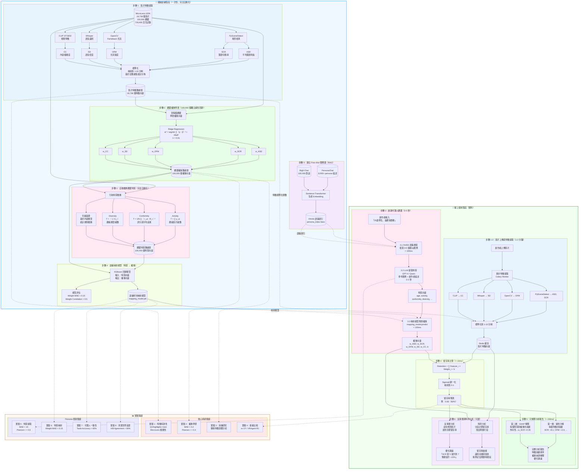

# SimLens 系統研究架構圖

## 完整系統架構




## 系統流程說明

### 離線訓練階段（一次性，2-3 天，完全自動化）

| 步驟 | 輸入 | 處理 | 輸出 | 時間 |
|------|------|------|------|------|
| 步驟 1 | 19,738 個影片 | PySceneDetect, OpenCV, Whisper, CLIP | 影片特徵數據庫 | 1-2 天 |
| 步驟 2 | 100,000 觀眾觀看歷史 | Ridge Regression（每人一個） | 觀眾權重數據庫 | 2-3 小時 |
| 步驟 3 | 觀看歷史 + 權重向量 | 統計推斷（Activity, Conformity, Diversity） | 觀眾特質數據庫 | 2-3 小時 |
| 步驟 4 | 特質向量 + 權重向量 | XGBoost 回歸 | 映射模型 | 1-2 小時 |
| 步驟 5 | PersonaChat + Big5-Chat | Sentence Transformer + FAISS | Few-shot 範例庫 | 2-3 小時 |

### 線上使用階段（實時）

| 步驟 | 輸入 | 處理 | 輸出 | 時間 |
|------|------|------|------|------|
| 步驟 1-2 | 創作者上傳影片 | 異步特徵提取 | 影片特徵向量 | 1-2 分鐘 |
| 步驟 3.1 | 創作者描述 | FAISS 語義搜索 | 相似 Persona 範例 | < 100ms |
| 步驟 3.2 | 描述 + 範例 | LLM 提取特質 | 特質向量 | 2-3 秒 |
| 步驟 3.3 | 特質向量 | 映射模型預測 | 權重向量 | < 100ms |
| 步驟 4 | 特徵 × 權重 | 線性計算 + Sigmoid | 留存率預測 | < 10ms |
| 步驟 5 | 預測結果 | 線性分解 + SHAP | 可解釋分析報告 | < 150ms |
| 步驟 6 | 預測結果 | 反事實推理 + 時序分析 | 優化建議 + 留存率曲線 | 2-3 秒 |

### 數據集用途

| 數據集 | 角色 | 用途 | 階段 |
|--------|------|------|------|
| MicroLens-100K | 訓練數據 | 特徵提取、權重學習、特質推斷、映射模型訓練 | 離線 |
| PersonaChat | 教科書 | Few-shot 範例庫，教 LLM 提取特質 | 離線建立 + 線上使用 |
| Big5-Chat | 教科書 | Few-shot 範例庫，補充人格特質範例 | 離線建立 + 線上使用 |
| QVHighlights | 驗證數據 | 驗證特徵有效性（實驗 1） | 實驗 |
| TVSum | 驗證數據 | 驗證特徵有效性（實驗 1） | 實驗 |

### 模型清單

| 模型 | 類型 | 用途 | 位置 |
|------|------|------|------|
| Ridge Regression × 100,000 | 線性回歸 | 學習每個觀眾的權重 | 離線步驟 2 |
| XGBoost | 樹模型 | 特質 → 權重映射 | 離線步驟 4 + 線上步驟 3.3 |
| Sentence Transformer | 語言模型 | 生成 Persona Embedding | 離線步驟 5 + 線上步驟 3.1 |
| GPT-4 / Qwen | LLM | 從文字描述提取特質 | 線上步驟 3.2 |
| SHAP TreeExplainer | 可解釋性 | 解釋映射模型的權重來源 | 線上步驟 5 |

### 可解釋性架構

```
第一層（內建）：線性分解
  Retention = w₁×ASD + w₂×SCR + w₃×OFM + w₄×SD + w₅×CC + b
  → 直接分解每個特徵的貢獻
  → 時間: < 10ms

第二層（SHAP）：權重來源解釋
  SHAP TreeExplainer 分析映射模型
  → 解釋每個特質對權重的貢獻
  → 例：外向性(70分) → w_SCR +0.35
  → 時間: < 100ms

第三層（反事實）：優化建議
  反向計算特徵變化
  → 告訴創作者如何修改影片達到目標留存率
  → 例：SCR 從 5 提升到 7 → 預期提升 +15%
  → 時間: < 50ms
```

### 核心公式

```
特徵標準化:
  ASD_score = 10 - min(9, (ASD - 1) / 1.0)
  SCR_score = min(10, (SCR - 2) / 2.8)
  OFM_score = min(10, OFM / 10)
  SD_score = SD × 10
  CC_score = min(10, CC × 20)

權重學習:
  w_u = argmin [∑(retention_actual - w·features)² + λ‖w‖²]

留存率預測:
  Retention_Score = sigmoid(∑ Feature_i × Weight_i + b)

行為特質計算:
  Activity = ∑ y_ui (觀看影片總數)
  Conformity = (1/N) ∑ |r_ui - R_i|²
  Diversity = |∪ G_i| (觀看類型總數)
```
