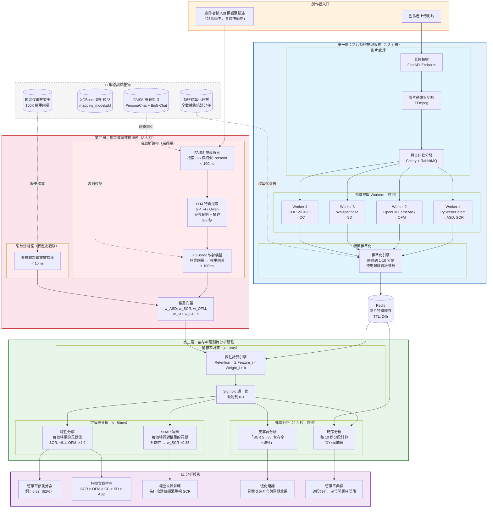

# SimLens 系統架構圖（以線上使用流程為主）

## 線上流程系統架構



## 線上流程步驟說明

### 整體流程時間線

```
創作者操作                    系統處理                         時間
─────────────────────────────────────────────────────────────────
上傳影片 ──────────────→ 影片接收 + 轉碼                    即時
                         異步特徵提取（4 Workers 並行）      1-2 分鐘
輸入觀眾描述 ──────────→ FAISS 語義搜索                     < 100ms
                         LLM 提取特質                        2-3 秒
                         映射模型預測權重                     < 100ms
                         ─────────────────────────────────
                         留存率計算                           < 10ms
                         線性分解 + SHAP 解釋                 < 150ms
                         反事實分析 + 時序分析                 2-3 秒
                         ─────────────────────────────────
收到完整分析報告 ←──────── 報告生成                          即時
─────────────────────────────────────────────────────────────────
總計：約 2 分鐘（瓶頸在特徵提取）
```

### 第一層：影片特徵提取服務

對應三層架構的第一層「客觀影片特徵提取」。

| 組件 | 技術選型 | 職責 | 延遲 |
|------|---------|------|------|
| 影片接收 | FastAPI | 接收上傳、驗證格式 | 即時 |
| 影片轉碼 | FFmpeg | 統一格式、提取幀 | 5-10 秒 |
| 任務分發 | Celery + RabbitMQ | 將特徵提取任務分發到 Workers | 即時 |
| 場景檢測 Worker | PySceneDetect 0.6.x | 計算 ASD、SCR | 20-30 秒 |
| 光流計算 Worker | OpenCV 4.x Farneback | 計算 OFM | 30-40 秒 |
| 語音檢測 Worker | Whisper base/small | 計算 SD | 30-60 秒 |
| 視覺特徵 Worker | CLIP ViT-B/32 | 計算 CC | 20-30 秒 |
| 標準化引擎 | NumPy | 映射到 1-10 分制 | < 1ms |
| 特徵緩存 | Redis | 緩存特徵向量，TTL 24h | < 1ms |

四個 Workers 並行執行，總時間取決於最慢的 Worker（Whisper，約 30-60 秒）。

### 第二層：觀眾權重建模服務

對應三層架構的第二層「觀眾權重學習」。線上階段有兩條路徑：

**冷啟動路徑**（新觀眾，無歷史數據）：

| 步驟 | 組件 | 技術選型 | 延遲 |
|------|------|---------|------|
| 3.1 | FAISS 語義搜索 | Sentence Transformer + FAISS | < 100ms |
| 3.2 | LLM 特質提取 | GPT-4 / Qwen + Few-shot Prompt | 2-3 秒 |
| 3.3 | 權重映射 | XGBoost 回歸模型 | < 100ms |

**暖啟動路徑**（有歷史數據的觀眾）：

| 步驟 | 組件 | 技術選型 | 延遲 |
|------|------|---------|------|
| 直接查詢 | 權重數據庫 | PostgreSQL / Redis | < 10ms |

### 第三層：留存率預測與分析服務

對應三層架構的第三層「留存率計算」，加上可解釋性分析。

| 功能 | 計算方式 | 延遲 | 輸出 |
|------|---------|------|------|
| 留存率計算 | Σ Feature_i × Weight_i + b → Sigmoid | < 10ms | 0-1 分數 |
| 線性分解 | 直接拆解每個 Feature × Weight | < 1ms | 特徵貢獻排序 |
| SHAP 解釋 | TreeExplainer 分析 XGBoost | < 100ms | 特質→權重貢獻 |
| 反事實分析 | 反向求解 ΔFeature = ΔRetention / Weight | < 50ms | 優化建議 |
| 時序分析 | 分段提取特徵 → 逐段計算留存率 | 2-3 秒 | 留存率曲線 |

## 離線訓練產物

線上流程依賴以下離線訓練產物（一次性生成，定期更新）：

| 產物 | 來源 | 大小 | 更新頻率 |
|------|------|------|---------|
| FAISS 語義索引 | PersonaChat + Big5-Chat | ~500MB | 每月 |
| XGBoost 映射模型 | MicroLens-100K 訓練 | ~10MB | 每月 |
| 觀眾權重數據庫 | 100K 用戶 Ridge Regression | ~50MB | 每週 |
| 特徵標準化參數 | 全數據集統計分佈 | < 1KB | 每月 |

## 技術棧總覽

```
┌─────────────────────────────────────────────────────────┐
│                     前端 (Frontend)                      │
│  React + TypeScript                                      │
│  創作者儀表板 / 影片上傳 / 報告視覺化                    │
├─────────────────────────────────────────────────────────┤
│                   API 網關 (Gateway)                     │
│  FastAPI (Python) + Nginx                                │
│  JWT 認證 / Rate Limiting / SSL                          │
├─────────────────────────────────────────────────────────┤
│               線上服務層 (Online Services)                │
│                                                          │
│  ┌──────────────┐  ┌──────────────┐  ┌──────────────┐  │
│  │ 影片處理服務  │  │ 觀眾建模服務  │  │ 預測分析服務  │  │
│  │              │  │              │  │              │  │
│  │ FFmpeg       │  │ FAISS        │  │ 線性計算     │  │
│  │ Celery       │  │ LLM API      │  │ SHAP         │  │
│  │ 4x Workers   │  │ XGBoost      │  │ 反事實引擎   │  │
│  └──────────────┘  └──────────────┘  └──────────────┘  │
├─────────────────────────────────────────────────────────┤
│              模型服務層 (Model Serving)                   │
│                                                          │
│  PySceneDetect │ OpenCV │ Whisper │ CLIP │ XGBoost      │
│  (各自 Docker 容器，GPU 加速)                            │
├─────────────────────────────────────────────────────────┤
│               數據層 (Data Layer)                        │
│                                                          │
│  Redis          │ PostgreSQL      │ MinIO               │
│  特徵緩存       │ 權重/元數據     │ 影片文件存儲        │
├─────────────────────────────────────────────────────────┤
│              消息隊列 (Message Queue)                    │
│  RabbitMQ + Celery Workers                               │
│  異步特徵提取任務                                        │
├─────────────────────────────────────────────────────────┤
│              基礎設施 (Infrastructure)                   │
│  Docker Compose (開發) / Kubernetes (生產)               │
│  Prometheus + Grafana (監控)                             │
└─────────────────────────────────────────────────────────┘
```

