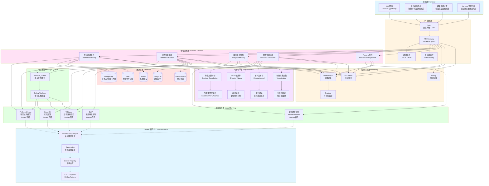

# SimLens 系統架構圖（可上線版本）



## 系統架構說明

### 1. 前端層 (Frontend)
- **Web 應用**：React + TypeScript 構建的單頁應用
- **創作者儀表板**：視頻上傳、特徵分析、優化建議
- **觀眾模擬介面**：模擬觀眾反應、留存率預測
- **Persona 管理介面**：創建和測試虛擬觀眾

### 2. API 網關層 (API Gateway)
- **Nginx**：負載均衡、SSL 終止、靜態文件服務
- **API Gateway**：FastAPI (Python) 或 Express (Node.js)
- **認證服務**：JWT + OAuth2 創作者認證
- **限流與監控**：防止 API 濫用

### 3. 後端服務層 (Backend Services)

#### 視頻處理服務 (Video Processing)
- 視頻上傳、轉碼、切片
- 視頻元數據提取
- 視頻存儲管理

#### 特徵提取服務 (Feature Extraction)
- 調用模型服務提取5個特徵
- 特徵標準化和緩存
- 批量處理支持

#### 權重學習服務 (Weight Learning)
- 從觀眾觀看歷史學習權重
- Persona 特質到權重映射
- 權重更新和版本管理

#### 觀眾預測服務 (Audience Prediction)
- 留存率預測
- 觀眾反應模擬
- A/B 測試支持

#### Persona 服務 (Persona Management)
- Persona 創建和管理
- 特質提取和驗證
- 虛擬觀眾行為模擬

### 4. 模型服務層 (Model Serving)

所有模型服務均使用 Docker 容器化部署：

#### PySceneDetect 容器
```dockerfile
FROM python:3.9-slim
RUN pip install scenedetect[opencv]
EXPOSE 8001
CMD ["python", "scene_detection_service.py"]
```

#### OpenCV 容器
```dockerfile
FROM python:3.9-slim
RUN pip install opencv-python numpy
EXPOSE 8002
CMD ["python", "optical_flow_service.py"]
```

#### Whisper 容器
```dockerfile
FROM python:3.9-slim
RUN pip install openai-whisper
EXPOSE 8003
CMD ["python", "speech_detection_service.py"]
```

#### CLIP 容器
```dockerfile
FROM pytorch/pytorch:latest
RUN pip install clip transformers
EXPOSE 8004
CMD ["python", "clip_service.py"]
```

#### 權重映射模型容器
```dockerfile
FROM tensorflow/tensorflow:latest
COPY model/ /app/model/
EXPOSE 8005
CMD ["python", "weight_mapping_service.py"]
```

### 5. 可解釋 AI 層 (Explainable AI)

#### 特徵貢獻分析 (Feature Contribution)
```python
def explain_prediction(video_features, user_weights):
    """
    分解留存率預測為各特徵貢獻
    """
    contributions = {
        'ASD': video_features['ASD'] * user_weights['w_ASD'],
        'SCR': video_features['SCR'] * user_weights['w_SCR'],
        'OFM': video_features['OFM'] * user_weights['w_OFM'],
        'SD': video_features['SD'] * user_weights['w_SD'],
        'CC': video_features['CC'] * user_weights['w_CC']
    }
    
    # 排序特徵重要性
    sorted_features = sorted(
        contributions.items(), 
        key=lambda x: abs(x[1]), 
        reverse=True
    )
    
    return {
        'contributions': contributions,
        'feature_importance': sorted_features,
        'total_score': sum(contributions.values())
    }
```

#### SHAP 值計算 (Shapley Values)
```python
import shap

def compute_shap_values(model, video_features):
    """
    計算 SHAP 值以解釋模型預測
    """
    explainer = shap.LinearExplainer(model, video_features)
    shap_values = explainer.shap_values(video_features)
    
    return {
        'shap_values': shap_values,
        'base_value': explainer.expected_value,
        'feature_names': ['ASD', 'SCR', 'OFM', 'SD', 'CC']
    }
```

#### 反事實解釋 (Counterfactual Explanation)
```python
def generate_counterfactual(video_features, target_retention=0.8):
    """
    生成反事實解釋：如何修改視頻以達到目標留存率
    """
    current_retention = predict_retention(video_features)
    gap = target_retention - current_retention
    
    suggestions = []
    
    # 計算每個特徵需要改變多少
    for feature in ['ASD', 'SCR', 'OFM', 'SD', 'CC']:
        weight = user_weights[f'w_{feature}']
        required_change = gap / weight
        
        if abs(required_change) <= 2:  # 可行的改變
            suggestions.append({
                'feature': feature,
                'current_value': video_features[feature],
                'suggested_value': video_features[feature] + required_change,
                'change': required_change,
                'actionable_advice': get_advice(feature, required_change)
            })
    
    return sorted(suggestions, key=lambda x: abs(x['change']))
```

#### 視覺化儀表板 (Visualization Dashboard)
- **留存率曲線**：時序分析圖表
- **特徵雷達圖**：5個特徵的分數分佈
- **權重熱力圖**：觀眾群體的權重分佈
- **對比分析**：多個視頻的特徵對比

### 6. 數據庫層 (Database)

#### PostgreSQL
- 創作者信息、視頻元數據
- 權重向量存儲
- 關係型數據

#### Redis
- 特徵向量緩存
- 會話管理
- 實時排行榜

#### MongoDB
- 觀看歷史記錄
- 觀眾行為日誌
- 非結構化數據

#### Elasticsearch
- 視頻全文搜索
- 日誌搜索
- 實時分析

#### MinIO
- 視頻文件存儲
- S3 兼容對象存儲
- 分佈式存儲

### 7. 消息隊列 (Message Queue)

#### RabbitMQ/Kafka
- 異步任務隊列
- 事件驅動架構
- 服務解耦

#### Celery Workers
- 視頻處理任務
- 特徵提取任務
- 權重學習任務
- 定時任務

### 8. 監控與日誌 (Monitoring)

#### Prometheus + Grafana
- 系統指標監控
- API 性能監控
- 模型推理延遲監控

#### ELK Stack (Elasticsearch + Logstash + Kibana)
- 日誌聚合
- 日誌搜索
- 日誌分析

#### Sentry
- 錯誤追蹤
- 性能監控
- 創作者反饋

### 9. Docker 容器化 (Containerization)

#### docker-compose.yml (本地開發)
```yaml
version: '3.8'

services:
  # 前端
  frontend:
    build: ./frontend
    ports:
      - "3000:3000"
    depends_on:
      - api-gateway

  # API 網關
  api-gateway:
    build: ./api-gateway
    ports:
      - "8000:8000"
    depends_on:
      - postgres
      - redis
      - rabbitmq

  # 模型服務
  scene-detection:
    build: ./models/scene-detection
    ports:
      - "8001:8001"
    deploy:
      resources:
        reservations:
          devices:
            - driver: nvidia
              count: 1
              capabilities: [gpu]

  optical-flow:
    build: ./models/optical-flow
    ports:
      - "8002:8002"

  whisper:
    build: ./models/whisper
    ports:
      - "8003:8003"
    deploy:
      resources:
        reservations:
          devices:
            - driver: nvidia
              count: 1
              capabilities: [gpu]

  clip:
    build: ./models/clip
    ports:
      - "8004:8004"
    deploy:
      resources:
        reservations:
          devices:
            - driver: nvidia
              count: 1
              capabilities: [gpu]

  weight-mapping:
    build: ./models/weight-mapping
    ports:
      - "8005:8005"

  # 數據庫
  postgres:
    image: postgres:14
    environment:
      POSTGRES_DB: simlens
      POSTGRES_USER: simlens
      POSTGRES_PASSWORD: simlens
    volumes:
      - postgres-data:/var/lib/postgresql/data

  redis:
    image: redis:7
    ports:
      - "6379:6379"

  mongodb:
    image: mongo:6
    ports:
      - "27017:27017"
    volumes:
      - mongo-data:/data/db

  elasticsearch:
    image: elasticsearch:8.8.0
    environment:
      - discovery.type=single-node
    ports:
      - "9200:9200"

  minio:
    image: minio/minio
    command: server /data --console-address ":9001"
    ports:
      - "9000:9000"
      - "9001:9001"
    volumes:
      - minio-data:/data

  # 消息隊列
  rabbitmq:
    image: rabbitmq:3-management
    ports:
      - "5672:5672"
      - "15672:15672"

  # 監控
  prometheus:
    image: prom/prometheus
    ports:
      - "9090:9090"
    volumes:
      - ./prometheus.yml:/etc/prometheus/prometheus.yml

  grafana:
    image: grafana/grafana
    ports:
      - "3001:3000"
    depends_on:
      - prometheus

volumes:
  postgres-data:
  mongo-data:
  minio-data:
```

#### Kubernetes 部署 (生產環境)
```yaml
apiVersion: apps/v1
kind: Deployment
metadata:
  name: simlens-api
spec:
  replicas: 3
  selector:
    matchLabels:
      app: simlens-api
  template:
    metadata:
      labels:
        app: simlens-api
    spec:
      containers:
      - name: api
        image: simlens/api:latest
        ports:
        - containerPort: 8000
        resources:
          requests:
            memory: "512Mi"
            cpu: "500m"
          limits:
            memory: "1Gi"
            cpu: "1000m"
        env:
        - name: DATABASE_URL
          valueFrom:
            secretKeyRef:
              name: simlens-secrets
              key: database-url
---
apiVersion: v1
kind: Service
metadata:
  name: simlens-api
spec:
  selector:
    app: simlens-api
  ports:
  - port: 80
    targetPort: 8000
  type: LoadBalancer
```

## 部署流程

### 本地開發
```bash
# 啟動所有服務
docker-compose up -d

# 查看日誌
docker-compose logs -f

# 停止服務
docker-compose down
```

### 生產部署
```bash
# 構建鏡像
docker build -t simlens/api:latest ./api-gateway
docker build -t simlens/scene-detection:latest ./models/scene-detection

# 推送到 Docker Registry
docker push simlens/api:latest
docker push simlens/scene-detection:latest

# 部署到 Kubernetes
kubectl apply -f k8s/

# 查看部署狀態
kubectl get pods
kubectl get services
```

## 性能優化

### 1. 特徵緩存
- 預計算並緩存所有視頻的特徵向量
- Redis 緩存熱門視頻特徵
- TTL 設置為 24 小時

### 2. 批量處理
- 使用矩陣運算批量計算留存率
- GPU 加速模型推理
- 異步任務隊列處理耗時操作

### 3. 水平擴展
- API 服務無狀態，可水平擴展
- 模型服務獨立部署，按需擴展
- 數據庫讀寫分離

### 4. CDN 加速
- 靜態資源 CDN 分發
- 視頻文件 CDN 加速
- API 響應緩存

## 安全性

### 1. 認證與授權
- JWT Token 認證
- OAuth2 第三方登錄
- RBAC 權限控制

### 2. 數據加密
- HTTPS/TLS 傳輸加密
- 數據庫加密存儲
- 敏感信息脫敏

### 3. API 安全
- Rate Limiting 限流
- CORS 跨域控制
- SQL 注入防護

## 可擴展性

### 1. 微服務架構
- 服務獨立部署
- 服務間通過 API 通信
- 服務發現與註冊

### 2. 插件化設計
- 新特徵提取器可插拔
- 新預測算法可擴展
- 新評估指標可添加

### 3. 多租戶支持
- 租戶隔離
- 資源配額管理
- 自定義配置
```
